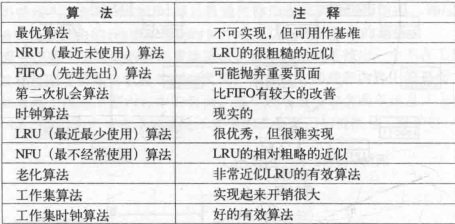

## 存储管理

### 地址空间
为每一个进程设置一个独立的内存,并不互相影响

##### 基址寄存器和界限寄存器
可以非常简单的为每个进程提供私有地址空间
如果只有操作系统可以修改,可以起到保护作用

##### 空闲内存管理
- 位图
- 空闲链表

### 内存超载的处理方法
- 覆盖技术(微软的DOS，内存仅640K，程序大—–手动覆盖（overlay），把需要的指令和数据保存在内存中)
- 交换技术(暂时不能执行的程序送到外存，代价大)
- 虚拟内存(以更小的页粒度单位在有限的内存中装入更多更大的程序)

##### 虚存机制
在分页、分段内存管理的硬件支持下，在装入程序时，只把当前需要执行的部分页或段装入内存，就可以开始执行； 
当执行到指令或数据不在内存上时（缺页、缺段异常），由处理器通知操作系统，若有空余空间则将相应的页面或段调入内存，继续执行； 
另一方面，os将内存中暂时不用的页、段调出保存在外存上以腾出空间。

##### 虚存技术基本特征
- 大的用户空间：内存可以小，硬盘必须足够。提供给用户的虚拟空间=物理内存+硬盘。
- 部分交换：swap in /swap out 是对部分虚拟地址空间进行的
- 不连续：物理内存分配的不连续，虚拟空间使用的不连续（内外存）

### 页表

##### 加速虚拟地址到物理地址的访问速度
1. 转换检测缓存区(TLB),也叫快表 (虚拟页面号->页框号)
2. 软件TLB

##### 针对大内存的页表
- 多级页表
- 倒排页表
- 页面置换

##### 页面置换算法

##### 缺页中断率
根据缺页中断率来动态分配进程的页框

### 负载控制(分页/交换)
如果一味的根据缺页中断率来动态的分配页框,每个程序都需要足够的页框,那么所有的程序都不能很快的执行,所以需要将一些进程交换到磁盘,暂停运行

##### linux内存管理算法
- 伙伴(Buddy)管理:管理大内存,按照2^k将页框分组为11个块链表,包含1,2,4,8,16,32,64,128,256,512,1024个连续的页框,最大4M,内存分配的时候对这些块链表搜索,没有合适的就从大的上面分,释放的内存就合并
- slab分配器:对页进行管理

