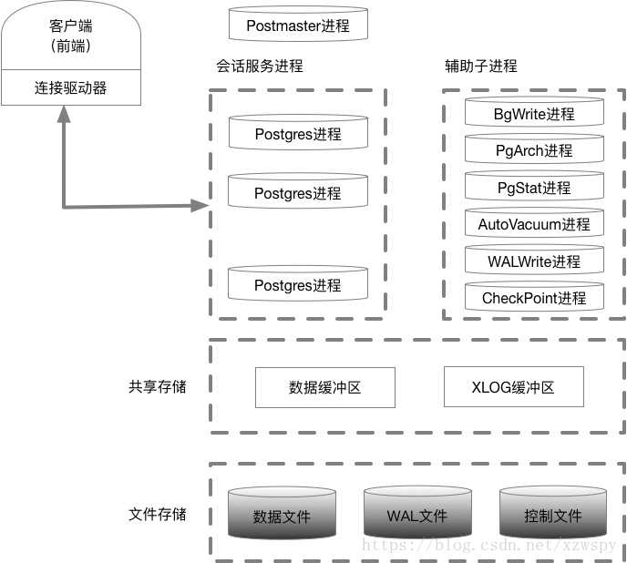
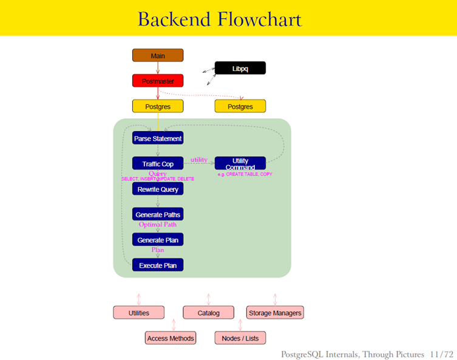

## 核心架构

[Pg进程和内存结构](https://www.cnblogs.com/ilifeilong/p/6995260.html)

## 进程和内存架构图

1. 主进程:PostMaster进程
2. 辅助进程:SysLogger（系统日志）进程、BgWriter（后台写）进程、WALWrite（预写式日志）进程、PgArch（归档）进程、AutoVacuum（系统自动清理）进程、PgStat（统计收集）进程、CheckPoint（检查点）进程

### 主进程 Postmaster
是整个数据库实例的总控进程，负责启动和关闭该数据库实例。

### Syslogger（系统日志）进程
需要在Postgres.conf中logging_collection设置为on，此时主进程才会启动Syslogger辅助进程

### BgWriter(后台)进程
把共享内存中的脏页写到磁盘上的进程。主要是为了提高插入、更新和删除数据的性能

### WalWrite（预写式日志）进程
在修改数据之前把修改操作记录到磁盘中，以便后面更新实时数据时就不需要数据持久化到文件中

### PgArch（归档）进程
WAL日志会被循环使用，PgArch在归档前会把WAL日志备份出来。通过PITY（Point in Time Recovery）技术，可以对数据库进行一次全量备份后，该技术将备份时间点之后的WAL日志通过归档进行备份，使用数据库的全量备份再加上后面产生的WAL日志，即可把数据库向前推到全量备份后的任意一个时间点

### AutoVacuum（自动清理）进程
在PostgreSQL数据库中，对表进行DELETE操作后，旧的数据并不会立即被删除，并且，在更新数据时，也并不会在旧的数据上做更新，而是新生成一行数据。旧的数据只是被标识为删除状态，只有在没有并发的其他事务读到这些旧数据时，它们才会被清楚。这个清除工作就有AutoVacuum进程完成

### PgStat（统计数据收集）进程
做数据的统计收集工作。主要用于查询优化时的代价估算，包括一个表和索引进行了多少次的插入、更新、删除操作，磁盘块读写的次数、行的读次数。pg_statistic中存储了PgStat收集的各类信息

### CheckPoint 进程
名检查点，一般checkpoint会将某个时间点之前的脏数据全部刷新到磁盘，以实现数据的一致性与完整性

也就是说，以下几种情况会触发数据库操作系统做检查点操作：
超级用户（其他用户不可）执行CHECKPOINT命令
数据库shutdown
数据库recovery完成
XLOG日志量达到了触发checkpoint阈值
周期性地进行checkpoint
需要刷新所有脏页

### 共享内存
PostgreSQL启动后，会生成一块共享内存，用于做数据块的缓冲区，以便提高读写性能。WAL日志缓冲区和Clog缓冲区也存在共享内存中，除此之外还有全局信息比如进程、锁、全局统计等信息也保存在共享内存中

### 本地内存
非全局存储的数据都存在本地内存中，主要包括：
- 临时缓冲区：用于访问临时表的缓冲区
- work_mem: 内部排序操作和Hash表在使用临时操作文件之前使用的存储缓冲区。
- manintance_work_mem: 在维护操作比如：VACUUM、CREATE INDEX、ALTER TABLE ADD FOREIGN Key等中使用的内存缓冲区。

### PostgreSQL 的 MVCC 机制是如何工作的？
- 每行数据通过隐藏字段 xmin（插入事务ID）和 xmax（删除/更新事务ID）标记版本。
- 事务通过 ​Read View​ 判断数据可见性，仅读取 xmin < 当前事务ID 且 xmax 未提交或大于当前事务ID 的版本。

## SQL执行流程

[sql执行流程](http://blog.itpub.net/29898569/viewspace-1847987/)

