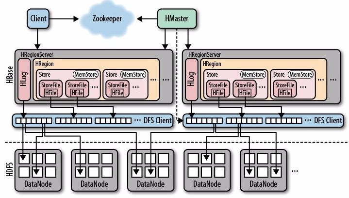
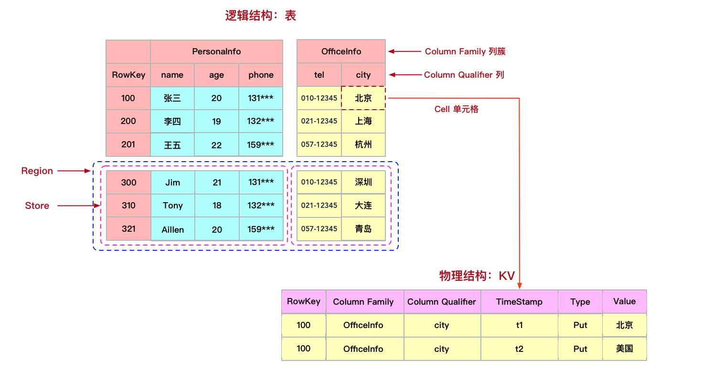
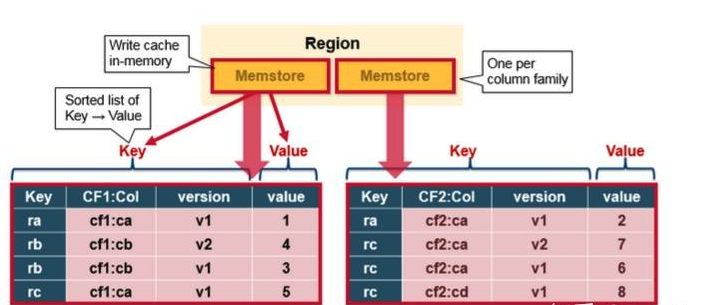

# HBase


## 定义

Apache HBase™ 是 Hadoop 数据库，是一个开源、分布式、版本化、可扩展的、非关系数据库，支持对大数据进行随机、实时读/写访问。
是在 Hadoop 和 HDFS 之上提供类似 Bigtable 的功能。

## 简单认识

- [安装单节点](https://hbase.apache.org/book.html#quickstart)
- 启动：./start-hbase.sh
- [访问UI](http://localhost:16010/master-status)
- 基本命令：
  ```shell
  # 启动shell
  ./bin/hbase shell
  # 创建表
  create 'test', 'cf'
  # 查看表
  list 'test'
  # 写入数据
  put 'test', 'row1', 'cf:a', 'value1'
  put 'test', 'row2', 'cf:b', 'value2'
  put 'test', 'row3', 'cf:c', 'value3'
  # 查看表的数据
  scan 'test'
  # 获取一行的数据
  get 'test', 'row1'
  # 修改数据
  put 'test', 'row1', 'cf:a', 'new01'
  # 再次查看数据
  scan 'test'
  # 获取一行的数据
  get 'test', 'row1'
  # 禁用表
  disable 'test'
  # 启用表
  enable 'test'
  # 删除表
  drop 'test'
  ```

## 架构



### 组件介绍

- Region Server：负责数据的读写服务（管理大约1000个region），与用户交互。
  - Block Cache：读缓存，用LRU淘汰策略。
  - Bloom Filter：布隆过滤器，读请求判断是否存在磁盘。
  - HLog：WAL(Write Ahead Log)存储尚未写入永久性存储区中的新数据，用于故障恢复。
  - Region：包含了一段处于某一起始键值和终止键值之间的连续的行键，默认大小为1GB。
    - MemStore：MemStore是写缓存，存储WAL排序后的数据。
    - Hfiles：持久化数据，根据排序号的键存储数据行，有B+树索引文件，加速读取。
- HMaster：负责Region的分配及数据库的创建和删除等操作。
- ZooKeeper：负责维护集群的状态（某台服务器是否在线，服务器之间数据的同步操作及master的选举等）。
- DataNode：数据以HDFS文件的形式存储。
- META table：目录作用，保存集群region的地址信息（region的起始键，region server），存于ZooKeeper中。

### 数据模型



- 其中Key则是由Rowkey、Column Family : Column Qualifier、Timestamp、Type等几个维度组成。
  - rowkey是HBase的行键。
  - column family（列族）与qualifier（列限定符即列名）共同组成了HBase的列。
  - timestamp表示的就是数据写入时的时间戳，用于标识HBase数据的版本号。
  - type代表Put/Delete的操作类型。
- HBase的表具有稀疏特性，一行中空值的列并不占用任何存储空间。

### 第一次读写

- 客户端从ZooKeeper中得到保存META table的Region server的信息。
- 客户端向该Region server查询负责管理自己想要访问的row key的所在的region的Region server的地址。客户端会缓存这一信息以及META table所在位置的信息。
- 客户端与负责其row所在region的Region Server通信，实现对该行的读写操作。
- 缓存寻找相应的Region server地址，不再可达。这时客户端会重新访问META table并更新缓存。

### 写操作

- 连接Region server。
- 写WAL文件，顺序写（快）.
- 写MemStore。
- 返回成功。

### Memstore flush到磁盘



- 底层存储引擎是基于LSM-Tree数据结构设计的。
- 每一个Region中的每一个Column family对应一个MemStore文件。
- 当MemStore中积累了足够多的数据之后，整个MemCache中的数据会被一次性写入到HDFS里的一个新的HFile中，因此HDFS中一个Column family可能对应多个HFile。
- HBase会自动选取一些较小的HFile进行合并，并将结果写入几个较大的HFile中，过程中删除已经删除或过期的cell，更新现有cell的值。
- 合并过程使得当前Region基本是处于不可访问的状态，俗称写放大。（可配置合并的时间）

### 读操作

- 连接Region server。
- 从Block cache，寻找数据。
- 从MemStore中寻找数据。
- 有数据，合并返回。
- 以上都没有，系统会接着根据索引和布隆过滤器，从相应的HFile中读取目标行的cell的数据。

### 读写并发控制

- 采用的是MVCC机制，来保证读写的数据总能够保持一致性。
- 为每一个写入/更新事务分配一个Region级别自增的序列号。
- 为每一个读请求分配一个已完成的最大写事务序列号。

### 备份与恢复

- HDFS会自动备份WAL和HFile，HBase基于HDFS来提供可靠的安全的数据存储。当数据被写入HDFS本地时，另外两份备份数据会分别存储在另外两台服务器上。
- WAL文件和HFile都存储于硬盘上且存在备份，因此恢复它们是非常容易的，新的Region Server会读取并顺序执行WAL中的数据操作，从而重新创建相应的MemStore。

### 优缺点

- 优点：
  - 容量大：HBase单表可以很庞大，加上其分布式、高伸缩性的特点，使得HBase特别适合海量数据的永久性存储。
  - 高性能：HBase具有非常高的读写性能，基于LSM-Tree的数据结构使得HBase写入数据性能强劲，另外得益于HBase读路径上的各种设计及优化，HBase读数据的性能也可以保持在毫秒级。
  - 高可靠：因为数据写路径上是先写WAL日志，防止缓存数据的丢失，加上HBase底层数据的多副本机制，保证了数据的可靠性。
  - 原始支持Hadoop：HBase底层存储基于HDFS，也原生集成了MapReduce做离线计算。HBase这种架构体系也使得HBase非常易于扩展。
  - 无模式：HBase的表是schema-free的，无需提前定义schema，只会在数据写入时才会增加列。
  - 稀疏性：HBase是表具有稀疏性，null值的列并不占用任何存储空，这一点和关系库不同，大大节省了存储空间。
  - 多版本：HBase支持多版本，每一个单元格包含timestamp时间戳，标识着数据的版本号。

- 缺点：
  - 数据分析能力弱：数据分析是HBase的弱项，比如聚合运算、多维度复杂查询、多表关联查询等。所以，我们一般在HBase之上架设Phoenix或Spark等组件，增强HBase数据分析处理的能力。
  - 原生不支持二级索引：默认HBase只对rowkey做了单列索引，因此正常情况下对非rowkey列做查询比较慢。所以，我们一般会选择一个HBase二级索引解决方案，目前比较成熟的解决方案是Phoenix，此外还可以选择Elasticsearch/Solr等搜索引擎自己设计实现。
  - 原生不支持SQL：SQL查询也是HBase的一个弱项，好在这块可以通过引入Phoenix解决，Phoenix是专为HBase设计的SQL层。
  - 异常恢复慢，占用大量资源和I/O操作进行合并。

### 使用场景

- 没有事务要求的数据，数据量又很大（查少写多）
- 例如：交易完成后的数据，交易快照，用户浏览信息，IM消息，GPS信息


|    名称    |               适用场景               |     不适用场景     |
| :--------: | :----------------------------------: | :----------------: |
|   HBase    | 点查、大数据量写入、动态列、稀疏矩阵 | 复杂查询、数据分析 |
|    Hive    |               数据分析               |      频繁更新      |
|   Redis    |            高并发、低延迟            |      数据分析      |
| Clickhouse |               数据分析               |     高并发场景     |


## 资料

- [hbase文档](https://hbase.apache.org/book.html)
- [hbase原理](https://zhuanlan.zhihu.com/p/159052841)
- [多版本获取](https://blog.csdn.net/liuchuanhong1/article/details/53895234)
- [phoenix](https://phoenix.apache.org/download.html)
- [HBase 集成 Phoenix 构建二级索引实践](https://mp.weixin.qq.com/s?__biz=MzUxOTU5Mjk2OA==&mid=2247485318&idx=2&sn=c5151eba5582ac2e494e0cf7a64c4a0e&chksm=f9f60ae1ce8183f7d6faec6adbf495d247354cc70f9c48df2399a7fcaa72394b3335d64ce425&scene=21#wechat_redirect) 
- [Phoenix go驱动](https://github.com/apache/calcite-avatica-go)
