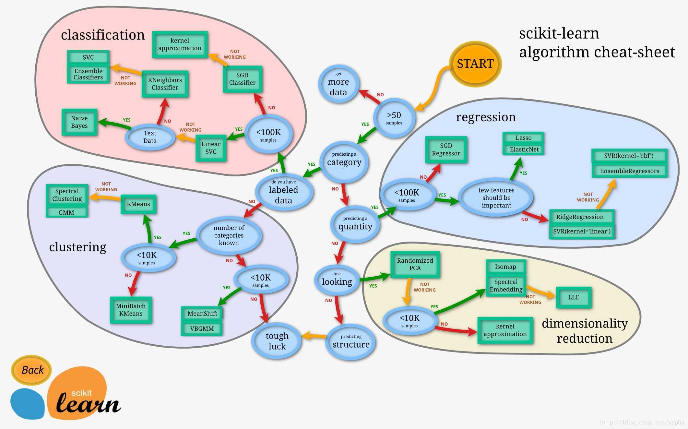

## sklearn



### model_selection模块的几个方法和参数
- train_test_split:切分数据(训练和测试数据集)
```bash
*array：切分数据源（list/np.array/pd.DataFrame/scipy_sparse matrices） 
test_size和train_size是互补和为1的一对值 
shuffle：对数据切分前是否洗牌 
stratify：是否分层抽样切分数据（ If shuffle=False then stratify must be None.）
```
- cross_validate:返回K折的每折得分
```bash
estimator：学习器 
X：特征列数据 
y：标签列（无监督学习可以无此参数） 
groups：切分train/test数据集后的样本所在集合标号 
scoring：在test数据集上的评估准则（以list/dict形式给出） 
cv：交叉验证的折数，default=3，也可以是其余int数据，或者cv generator 
n_jobs：计算执行时占用CPU个数，设置n_jobs=-1是利用全部CPU 
verbose：设置评估模型的相关打印信息输出详细程度 
fit_params：参数字典 
pre_dispatch：设置并行任务数（保护内存） 
return_train_score：返回train数据集上的评估得分
```
- cross_val_score:交叉验证的平均得分


- GridSearchCV:返回最佳参数组合/得分
```bash
estimator：学习器 
para_grid：参数字典 
scoring：在test数据集上的评估准则（以list/dict形式给出） 
n_jobs：计算执行时占用CPU个数，设置n_jobs=-1是利用全部CPU 
iid：是否假设样本同分布，建模时目标函数时计入每个样本的总损失 
cv：交叉验证的折数，default=3，也可以是其余int数据，或者cv generator 
verbose：设置评估模型的相关打印信息输出详细程度 
pre_dispatch：设置并行任务数（保护内存） 
return_train_score：返回train数据集上的评估得分 
error_score：设置estimator拟合出现错误时的相关提示信息，对refit有影响 
```

- learning_curve:学习曲线能判定偏差和方差问题

[学习曲线介绍](https://www.jianshu.com/p/e5ae0df64255)

```bash
estimator：学习器 
X：特征列数据 
y：标签列 
groups：切分train/test数据集后的样本所在集合标号 
train_sizes：设置训练集数据的变化取值范围 
cv：交叉验证的折数，default=3，也可以是其余int数据，或者cv generator 
scoring：在test数据集上的评估准则（以list/dict形式给出） 
n_jobs：计算执行时占用CPU个数，设置n_jobs=-1是利用全部CPU 
pre_dispatch：设置并行任务数（保护内存） 
verbose：设置评估模型的相关打印信息输出详细程度 
shuffle：对数据切分前是否洗牌 
random_state：随机种子 
exploit_incremental_learning：增量学习

```

```bash
# -*- coding:utf-8 -*-
import numpy as np
import matplotlib.pyplot as plt
from sklearn.datasets import load_breast_cancer
from sklearn.preprocessing import StandardScaler
from sklearn.linear_model import LogisticRegression
from sklearn.pipeline import Pipeline
from sklearn.model_selection import train_test_split,learning_curve,cross_val_score


plt.rcParams['font.sans-serif'] = ['SimHei']  # 中文字体设置
plt.rcParams['axes.unicode_minus'] = False

bc = load_breast_cancer()
X = bc.data
y = bc.target

# 分割数据
X_train,X_test,y_train,y_test = train_test_split(X,y,test_size=0.20,random_state=42)

# pipe
pipe_lr = Pipeline([
    ('scl',StandardScaler()),
    ('clf',LogisticRegression(penalty='l2',random_state=42,solver='lbfgs'))
])
scores = cross_val_score(pipe_lr,X=X_train,y=y_train,cv=10).mean()

print(scores)
# learn_curve
train_size,train_scores,test_scores = learning_curve(estimator=pipe_lr,X=X_train,y=y_train,train_sizes=np.linspace(0.1,1.0,5),cv=10)

train_mean = np.mean(train_scores,axis=1)
train_std = np.std(train_scores,axis=1)

test_mean=np.mean(test_scores,axis=1)
test_std = np.std(test_scores,axis=1)

plt.plot(train_size,train_mean,color='r',marker='o',markersize=5,label='train acu')
plt.fill_between(train_size,train_mean-train_std,train_mean+train_std,alpha=0.25,color='r')

plt.plot(train_size,test_mean,color='g',linestyle='--',marker='o',markersize=5,label='test acu')
plt.fill_between(train_size,test_mean-test_std,test_mean+test_std,alpha=0.25,color='g')

plt.grid()
plt.xlabel("train size")
plt.ylabel("acu")
plt.legend(loc='best')
plt.ylim([0.8,1.05])
plt.show()


```

- validate_curve:通过验证曲线判定不同的参数值产生的过拟合于欠拟合
