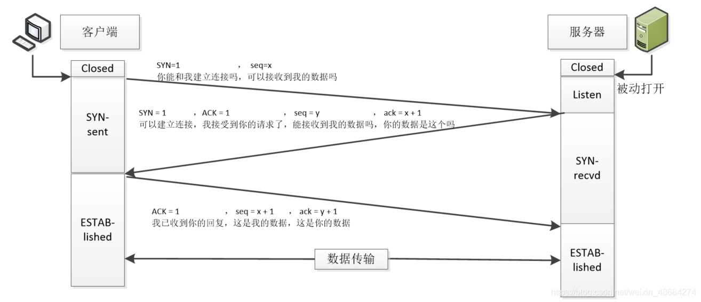
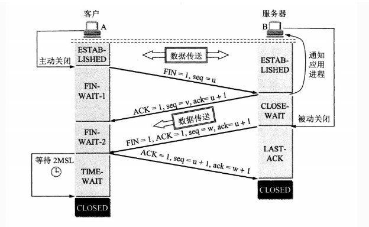

## TCP协议

- [详解](https://blog.csdn.net/sinat_36629696/article/details/80740678)
- [TCP三次握手](https://blog.csdn.net/weixin_48684274/article/details/108263608)

#### 概念

TCP（Transmission Control Protocol 传输控制协议）是一种面向连接的、可靠的、基于字节流的传输层通信协议

#### TCP标志位

- URG(urgent紧急)
- ACK(Acknowledge number 确认号码) 
- PSH(push传送) 有DATA数据传输
- RST(reset重置) 
- SYN(synchronous建立联机) 
- FIN(finish结束) 

 Seq Sequence number(顺序号码) 

#### 三次握手

1. 第一次握手：主机A发送位码为SYN＝1，随机产生**序号**(seq number)=x的数据包到服务器，主机B由SYN=1知道，A要求建立联机；
2. 第二次握手：主机B收到请求后要确认联机信息，向A发送**确认序号**(ack number)=(主机A的seq+1)，SYN=1，ACK=1，随机产生seq=y的包；
3. 第三次握手：主机A收到后检查**确认序号**(ack number)是否正确，即第一次发送的序号(seq number+1)，以及位码ACK是否为1，若正确，主机A会再发送**确认序号**(ack number)=(主机B的seq+1)，ACK=1，主机B收到后确认seq值与ACK=1则连接建立成功

##### 为什么不2次

防止已经失效的连接请求报文突然传送到服务器(比如服务端发到客户端的确认信息由于网络阻塞,客户端没收到,认为失败,重新发起连接/传送数据,过一会前一个连接到达,再次连接,造成数据错误和资源的浪费)

##### 为什么不4次

3次已经足够,4次多余

#### 四次挥手

1. 客户端进程发出连接释放报文，并且停止发送数据,释放数据报文首部，FIN=1，其序列号为seq=u（等于前面已经传送过来的数据的最后一个字节的序号加1），此时客户端进入FIN-WAIT-1（终止等待1）状态。 TCP规定，FIN报文段即使不携带数据，也要消耗一个序号
2. 服务器收到连接释放报文，发出确认报文，ACK=1，确认序号为 u+1，并且带上自己的序列号seq=v，此时服务端就进入了CLOSE-WAIT（关闭等待）状态
TCP服务器通知高层的应用进程，客户端向服务器的方向就释放了，这时候处于半关闭状态，即客户端已经没有数据要发送了，但是服务器若发送数据，客户端依然要接受。这个状态还要持续一段时间，也就是整个CLOSE-WAIT状态持续的时间
3. 客户端收到服务器的确认请求后，此时客户端就进入FIN-WAIT-2（终止等待2）状态，等待服务器发送连接释放报文（在这之前还需要接受服务器发送的最终数据）
4. 服务器将最后的数据发送完毕后，就向客户端发送连接释放报文，FIN=1，确认序号为v+1，由于在半关闭状态，服务器很可能又发送了一些数据，假定此时的序列号为seq=w，此时，服务器就进入了LAST-ACK（最后确认）状态，等待客户端的确认
5. 客户端收到服务器的连接释放报文后，必须发出确认，ACK=1，确认序号为w+1，而自己的序列号是u+1，此时，客户端就进入了TIME-WAIT（时间等待）状态。注意此时TCP连接还没有释放，必须经过2∗MSL（最长报文段寿命）的时间后，当客户端撤销相应的TCB后，才进入CLOSED状态
6. 服务器只要收到了客户端发出的确认，立即进入CLOSED状态。同样，撤销TCB后，就结束了这次的TCP连接。可以看到，服务器结束TCP连接的时间要比客户端早一些

##### 为什么客户端需要等待2MSL(Maximum Segment Lifetime)

- 保证客户端发送的最后一个ACK报文到达服务器,使二端都进入CLOSED状态
- 防止“已经失效的连接请求报文段”出现在新连接中

##### 为什么建立连接是3次握手,关闭连接是4次挥手

客户端发送FIN报文的时候,服务端可能还有数据传送给客户端,所以ACK和FIN报文是分开的,握手的时候是建立连接,ACK和SYN是同时给客户端

##### 建立连接的情况下,客户端突发故障怎么办

TCP有一个报活计时器,过了这个时间,服务端发送探活报文,如果客户端没反馈,就关闭

### TCP机制

1. 保证可靠性
    - 校验和
    - 序列号
    - 确认应答
    - 超时重传
    - 流量管理
    - 拥塞控制
    
2. 高性能
    - 滑动窗口
    - 快速重传
    - 延迟应答
    - 捎带应答
    
    
#### 滑动窗口

窗口大小指的是无需等待确认应答就可以继续发送数据的最大值

TCP为了保证性能,会一次性发送多个数据报文,不会一个确认完再发送一个

#### 流量控制

TCP支持根据接收端的处理能力, 来决定发送端的发送速度,防止接收端处理不过来,数据丢失,重传

#### 拥塞控制

TCP引入**慢启动**机制, 先发少量的数据, 探探路, 摸清当前的网络拥堵状态以后, 再决定按照多大的速度传输数据

#### 延迟应答

不会每个数据包都ACK,攒够一定数量或者超过一定时间应答一次

#### 捎带应答

一问一答情况下,顺便ACK

#### 面向字节流

创建一个TCP的socket, 同时在内核中创建一个 **发送缓冲区** 和一个 **接收缓冲区** ,当发送的数据大的情况,进行拆包

#### 粘包问题

 粘包问题中的 “包”, 是指**应用层的数据包**
 
 避免粘包问题: 长度前缀法是最通用可靠的解决方案
 
### TCP vs UDP 简单对比

| ​**特性**​               | ​**TCP**​                          | ​**UDP**​                          |
|------------------------|----------------------------------|----------------------------------|
| ​**连接方式**​           | 面向连接（需三次握手建立连接）   | 无连接（直接发送数据）           |
| ​**可靠性**​             | 可靠传输（确认、重传、校验）     | 不可靠传输（不保证数据到达）     |
| ​**数据顺序**​           | 保证数据顺序                     | 不保证顺序                       |
| ​**传输方式**​           | 流式传输（数据无边界，可能粘包） | 数据报传输（有明确边界，无粘包） |
| ​**流量控制**​           | 有（滑动窗口机制）               | 无                               |
| ​**拥塞控制**​           | 有（慢启动、拥塞避免等）         | 无                               |
| ​**头部开销**​           | 较大（20-60字节）                | 较小（8字节）                    |
| ​**传输效率**​           | 较低（因握手、确认等机制）       | 较高（无额外控制）               |
| ​**适用场景**​           | 要求可靠性的场景（如网页、邮件） | 要求实时性的场景（如视频、语音） |
| ​**典型应用**​           | HTTP、FTP、SMTP                  | DNS、在线游戏、直播流             |

---

### ​**核心区别总结**
1. ​**可靠性 vs 效率**​  
   - TCP 通过握手、确认、重传等机制保证可靠传输，但牺牲了效率。  
   - UDP 直接发送数据，效率高，但可能丢包或乱序。

2. ​**粘包问题**​  
   - TCP 是流式协议，数据无明确边界，需应用层处理粘包（如添加长度前缀）。  
   - UDP 是数据报协议，每个包独立传输，接收方一次读取一个完整包，无粘包问题。

3. ​**资源占用**​  
   - TCP 需要维护连接状态和重传缓冲区，占用更多系统资源。  
   - UDP 无连接状态，资源消耗更少。

 

