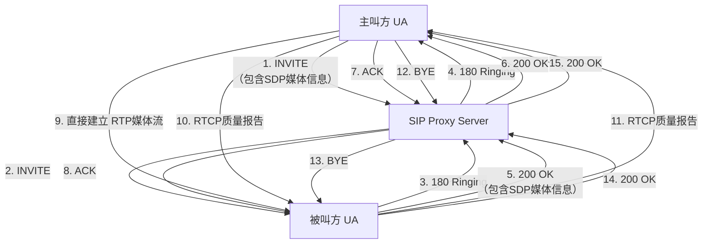

# SIP 和 RTP 协议简练介绍

## 🧠 核心概念速览

| 特性 | SIP (会话发起协议) | RTP (实时传输协议) |
|------|-------------------|-------------------|
| **核心角色** | 通信的“组织者” | 数据的“搬运工” |
| **主要功能** | 建立、管理和终止多媒体会话（呼叫信令） | 实时传输音视频数据流 |
| **协议关系** | 应用层控制协议（像接线员） | 传输层数据传输协议（像快递员） |
| **关键特点** | 基于文本，类似 HTTP，灵活易扩展 | 基于 UDP，提供时间戳和序列号，保证实时性 |
| **协作方式** | 通过 SDP 协商媒体参数（如编解码器），然后通知双方开始通过 RTP 传输媒体流。 | |

---

## 📡 SIP 协议简介

SIP 负责发起和控制通信会话，如语音通话或视频会议。

### 主要请求方法：
- `INVITE`：邀请对方加入会话（拨号）。
- `ACK`：确认最终响应。
- `BYE`：终止会话（挂断）。
- `REGISTER`：向服务器注册当前位置。

### 典型响应码：
- `100 Trying` / `180 Ringing`：呼叫进展中。
- `200 OK`：请求成功。
- `486 Busy Here`：对方线路忙。

---

## 📦 RTP/RTCP 协议简介

RTP 专门用于传输实时媒体数据，RTCP 是其配套协议，用于监控传输质量。

### RTP 的关键作用：
- **序列号**：处理数据包乱序和丢包检测。
- **时间戳**：解决网络抖动，保证音视频同步播放。

### RTCP 的作用：
- 定期发送报告，提供如丢包率、延迟抖动等服务质量反馈。

---

## 🔄 协同工作流程

一次成功的通话需要两者紧密配合：

1. **会话建立**：主叫方发送 `INVITE` 请求，其中包含 SDP 消息描述媒体能力。
2. **媒体协商**：被叫方通过 `200 OK` 响应回复其媒体参数，双方达成一致。
3. **媒体传输**：协商成功后，双方直接建立 RTP 通道传输音视频数据，RTCP 同时进行质量监控。
4. **会话终止**：一方发送 `BYE` 请求，结束会话和 RTP 流。