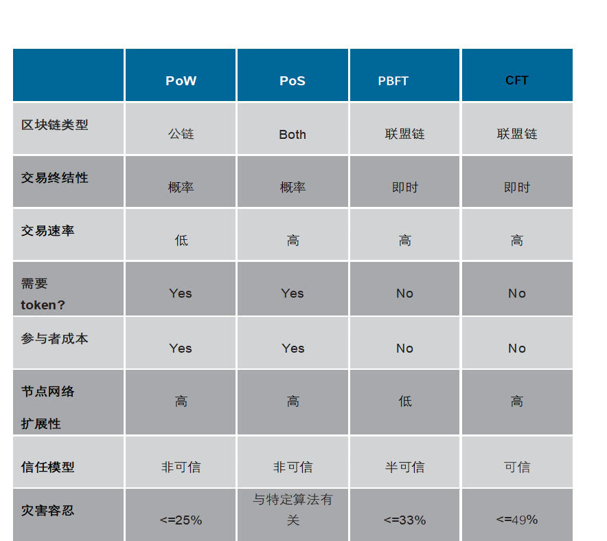

# 共识算法

## 对比资料
- [共识算法对比 ](https://blog.dteam.top/posts/2018-08/%E5%8C%BA%E5%9D%97%E9%93%BE%E5%91%A8%E5%91%A8%E8%AE%B0%E5%85%B1%E8%AF%86%E7%AE%97%E6%B3%95.html)

## WHY

为了实现分布式一致性协议而产生的一系列流程与规则。

## 根据是否容忍拜占庭错误，我们可以将共识算法分为两类：

- CFT(Crash Fault Tolerant)类共识算法：
    - 仅能够容忍宕机、网络延迟/断开等良性错误的共识算法。
    - 常用的共识算法有：Paxos，Raft以及基于Kafka的共识等等。
- BFT(Byzantine Fault Tolerant)类共识算法：
    - 除了能够容忍上述错误，还能够容忍任意类型的恶意攻击的共识算法。
    - 常用的共识算法有：
      - PBFT：Practical Byzantine Fault Tolerance，实用拜占庭容错算法
      - POW：Proof of Work，工作量证明
      - POS：Proof of Stake，股权证明

## 防止拜占庭攻击

- 在公有链中，常见的选择是通过工作量证明算法（PoW）来防止拜占庭攻击。
- 在联盟链中，常见的选择是通过理论完备的BFT共识算法来防止拜占庭攻击。