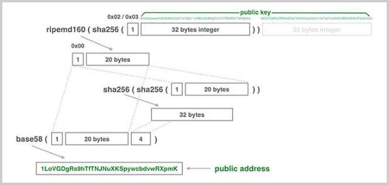

# 比特币

## 资料
- [比特币开发文档](https://developer.bitcoin.org/reference/rpc/)
- [浏览器](https://btc.com/zh-CN)

## 地址计算过程
- 1开头的比特币地址是如何创建的：
  - 根据公钥计算hash160；
  - 添加固定头并计算带校验的Base58编码。
  - 简单地概括就是使用Base58编码的公钥哈希。
- bc地址使用的不是Base58编码，而是Bech32编码，它的算法是：
  - 根据公钥计算hash160；
  - 使用Base32编码得到更长的编码；
  - 以bc作为识别码进行编码并带校验。

## Bech32地址和Base58地址相比
- 优点
  - 不用区分大小写，因为编码用的字符表没有大写字母；
  - 有个固定前缀，可任意设置，便于识别；
  - 生成的二维码更小。
- 缺点
  - 和现有地址不兼容，钱包程序必须升级；
  - 使用1作为分隔符，却使用了字母l，容易混淆；
  - 地址更长，有42个字符。

### 什么是延展性攻击
**ECDSA签名总是有两个有效签名，且可以相互计算；**
- 攻击者拿到一个交易，将其中inputSig 的r, s 提取出来， 使用 r, BN-s 生成新的inputSig, 然后组成新的交易，拥有同样的input和output，但是不同的TXID. 攻击者能在不掌握私钥的情况下几乎无成本地成功地生成了合法的交易。
- 如果交易所根据TXID来确认交易，修改了TXID,认为交易失败，重复给用户充值。

## 如何解决延展性攻击
- 方法1：ECDSA签名后总有两个有效的签名(r, s)和(r, -s mod N)，那只接受数值较小的那个签名，为此比特币引入了一个SCRIPT_VERIFY_LOW_S标志仅接受较小值的签名。
- 方法2：把签名数据移到交易之外，这样交易本身的哈希就不会变化。不含签名的交易计算出的哈希称为wtxid，为此引入了一种新的隔离见证地址。

## Bitcoin 钱包地址类型

- P2PKH（Pay-to-PubKeyHash）地址
  - 格式：以1开头，例如，1A1zP1eP5QGefi2DMPTfTL5SLmv7DivfNa。
  - 特点：这是最传统和最常见的地址类型，广泛用于比特币的早期交易。
  - 优点：兼容性好，几乎所有钱包和交易所都支持。
  - 缺点：随着时间的推移，这种地址类型的使用效率较低，交易费用可能会较高。

- P2SH（Pay-to-Script-Hash）地址
  - 格式：以3开头，例如，3J98t1WpEZ73CNmQviecrnyiWrnqRhWNLy。
  - 特点：这种地址允许更复杂的交易脚本，例如多重签名地址。
  - 优点：支持更复杂的交易和脚本，安全性更高。
  - 缺点：创建和管理比P2PKH地址更复杂。
  - - 最常见的多重签名是2-3类型。例如，一个提供在线钱包的服务，为了防止服务商盗取用户的资金，可以使用2-3类型的多重签名地址，服务商持有1个私钥，用户持有两个私钥，一个作为常规使用，一个作为应急使用。这样，正常情况下，用户只需使用常规私钥即可配合服务商完成正常交易，服务商因为只持有1个私钥，因此无法盗取用户资金。如果服务商倒闭或者被黑客攻击，用户可使用自己掌握的两个私钥转移资金。

- Bech32（SegWit）地址
  - 格式：以 bc1 开头，例如，bc1qar0srrr7xfkvy5l643lydnw9re59gtzzwfvenl。
  - 特点：这是比特币改进提案BIP-0173中引入的新地址格式，旨在提高交易效率和减少费用。
  - 优点：交易费用更低，处理速度更快，且有助于减少交易体积。
  - 缺点：并非所有的钱包和交易所都支持这种地址类型，尽管支持率在逐步增加。

## Unspent TX Output，即未花费交易输出。
- 想要确定某个人拥有的比特币，并无法通过某个账户查到，必须知道此人控制的所有UTXO金额之和。
- 对区块链进行查询之前，首先要扫描整个区块链，重建一个类似关系数据库的地址-余额映射表。
- 大多数钱包程序使用LevelDB来存储这些信息，手机钱包程序则是请求服务器，由服务器查询数据库后返回结果。
