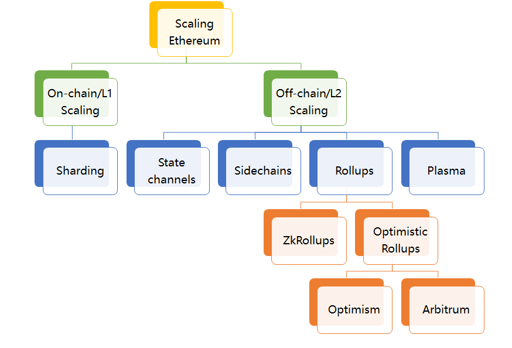

# Layer2

## 什么是 L2
L2（Layer2，二层网络）是一种以太坊的扩容方案，它是一条独立的区块链，扩展了以太坊并继承了以太坊的安全保证。

## 什么是 L1
L1，也就是第一层网络，指的是底层区块链基础设施。它们是整个区块链生态系统的基石，为上层应用和扩展方案提供了必要的基础架构和安全保障。以太坊和比特币都是典型的第一层网络区块链，因为它们各自提供了一个独立运行的、具备完整功能的区块链系统，包括交易处理、数据存储、以及网络共识机制等。

## 不可能三角
- 可扩展性：每秒可以处理大量交易。
- 去中心化：拥有大量参与区块生产和验证交易的节点。
- 安全性：获得网络的多数控制权需要非常高昂的成本。
以太坊和比特币比较关心的就是去中心化和安全性。而有一些新公链更注重的是可扩展性和安全性。

## 扩容方案

- 链上扩容
    - 分片（Sharding）技术：对区块链网络进行分片，从而增加其扩展性，目前 Sharding 方案仍然在跨分片通信、欺诈识别、随机分配与选举安全性等方面存在不足。

- 链下扩容
    - 状态通道（State Channel）：指用于执行交易和其他状态更新的“链下”技术。
    - 侧链（Sidechain）技术：侧链是平行于主链的一条链，由侧链上的验证者把一条链的最新状态提交给主链上的智能合约，这样持续推进的一类系统。侧链通常使用 PoA(Proof-of-Authority)、PoS(Proof of Stake) 等高效的共识算法。它的优势在于代码和数据与主链独立，不会增加主链的负担，缺陷在于它的安全性弱、不够去中心化，无法提供审查抗性、终局性和资金所有权保证。
    - Rollup（卷叠）：是目前最主流的 L2 扩容方案，Rollup 就是把一堆交易卷起来（Rollup）汇总成一个交易，所有接收到这个交易的节点只去验证执行结果，而不会验证逻辑。因此 Rollup 交易所需 Gas 费会远小于交易 Gas 费总和，TPS（每秒钟交易次数）也增加了。
        - Optimistic Rollup（乐观的 Rollup 协议）采用欺诈证明方法，即对链上发布的所有 Rollup 区块都保持乐观态度并假设其有效，它仅在欺诈发生的情况下提供证据。乐观 Rollup 的优势在于能使得原生 Layer1 上的 solidity 合约可以无缝移植到 Layer2，从而最大程度提升了技术人员的研发体验，目前主流方案包括 Optimism 和 Arbitrum。
        - ZK-Rollup 是基于零知识证明的 Layer2 扩容方案，采用有效性验证方法(VP)，默认所有交易都是不诚实的，只有通过有效性验证才会被接受。ZK-Rollup 在链下进行复杂的计算和证明的生成，链上进行证明的校验并存储部分数据保证数据可用性。目前主流的方案包括 zkSync、StarkNet、Scroll、Polygon Hermez 等。
    - Plasma方案：通过智能合约和Merkle树建立子链，每个子链都是一个可定制的智能合约，子链共存并独立运行，从而大幅降低主链的TPS压力。

## 零知识证明
零知识证明（zero-knowledge proof），简写为 ZKP，指的是证明者能够在不向验证者提供任何有用信息的情况下，使验证者相信某个论断是正确的。

## zkEVM 并没有统一的设计标准
- 为了兼容EVM，支持智能合约，所以有了zkEVM。
- 每个项目方基于不同角度在兼容 EVM 和支持 ZK 之间权衡设计出各自方案。
    - 编程语言层面支持，自定义 EVM 操作码，把 ZK-friendly 的操作抽出来重新设计新的、架构不同的虚拟机，通过编译器将 Soilidity 编译成新的虚拟机操作码。
    - 字节码层面支持，支持原生 EVM 操作码。

## zkSync
zkSync 1.0 ( zkSync Lite )：于 2020 年 6 月在以太坊主网上启动，zkSync1.0 是 zkSync 的轻量级版本，它提供了简化的支付和资产转移场景。但是它并不兼容以太坊虚拟机（EVM）。
zkSync 2.0 ( zkSync Era )：于 2023 年 3 月启动，zkSync 2.0 对比 1.0 最大的特点就是兼容 EVM，可以执行 Solidity 或以太坊开发中使用的其他高级语言编写的智能合约，极大的降低了开发成本。

