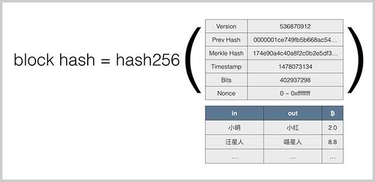

# 原理

## 区块链的不可篡改特性是由哈希算法保证的。

## Merkle Hash
- Merkle Hash是把一系列数据的哈希根据一个简单算法变成一个汇总的哈希。
- 修改任意一个交易哪怕一个字节，或者交换两个交易的顺序，都会导致Merkle Hash验证失败，也就会导致这个区块本身是无效的，所以，Merkle Hash记录在区块头部，它的作用就是保证交易记录永远无法修改。

## Block Hash

## 数字签名
- 防伪造，防篡改，防抵赖。
- 常用的数字签名算法有：RSA算法，DSA算法和ECDSA算法。
- 比特币采用的签名算法是椭圆曲线签名算法：ECDSA。
- 比特币的私钥是一个随机的非常大的256位整数,公钥是根据私钥推算出的两个256位整数。
- 地址并不是公钥，而是公钥的哈希。

## 共识
对区块交易达成共识。

## 可编程支付原理
比特币支付的本质是由程序触发的数字资产转移。这种支付方式无需信任中介的参与，可以在零信任的基础上完成数字资产的交易，这也是为什么数字货币又被称为可编程的货币。

