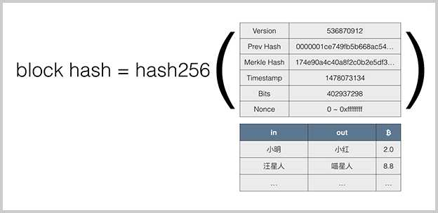

# 原理3

## 区块链的不可篡改特性是由哈希算法保证的。

## Merkle Hash
- Merkle Hash是把一系列数据的哈希根据一个简单算法变成一个汇总的哈希。
- 修改任意一个交易哪怕一个字节，或者交换两个交易的顺序，都会导致Merkle Hash验证失败，也就会导致这个区块本身是无效的，所以，Merkle Hash记录在区块头部，它的作用就是保证交易记录永远无法修改。

## Block Hash

## 数字签名
- 防伪造，防篡改，防抵赖。
- 常用的数字签名算法有：RSA算法，DSA算法和ECDSA算法。
- 比特币采用的签名算法是椭圆曲线签名算法：ECDSA。
- 比特币的私钥是一个随机的非常大的256位整数,公钥是根据私钥推算出的两个256位整数。
- 地址并不是公钥，而是公钥的哈希。

## 可编程支付原理
比特币支付的本质是由程序触发的数字资产转移。这种支付方式无需信任中介的参与，可以在零信任的基础上完成数字资产的交易，这也是为什么数字货币又被称为可编程的货币。

## p2p网络

## 节点发现和连接
- 当一个新节点加入网络时，它会使用种子服务器列表或者DNS查找来发现网络中的其他节点，然后尝试与这些节点建立直接连接

## 共识机制
确保所有的节点在没有中心权威的情况下也能就网络的状态达成一致.
- [共识](./共识.md)

## 加密技术
- 确保信息传输过程中内容不变。
- 确保公链上别人无法花自己的钱。

## 数据同步
- 区块传播：当一个节点完成新区块的挖掘或验证后，它会将区块传播到网络中的其他节点。
- 快速传播：比如广域传播和熵编码，这有助于在全球范围内实现近乎同时的数据更新。

## 容错机制和安全
- 强大的容错机制来处理故障和异常。拜占庭容错（BFT）机制允许网络在部分节点作恶或失效的情况下仍然能够正常运作。
- 防篡改设计和网络隔离等手段来增强系统的安全性。

## 扩展性考量
- 分片技术
- 状态通道

## 互操作性
- 跨链技术：哈希锁定和侧链

