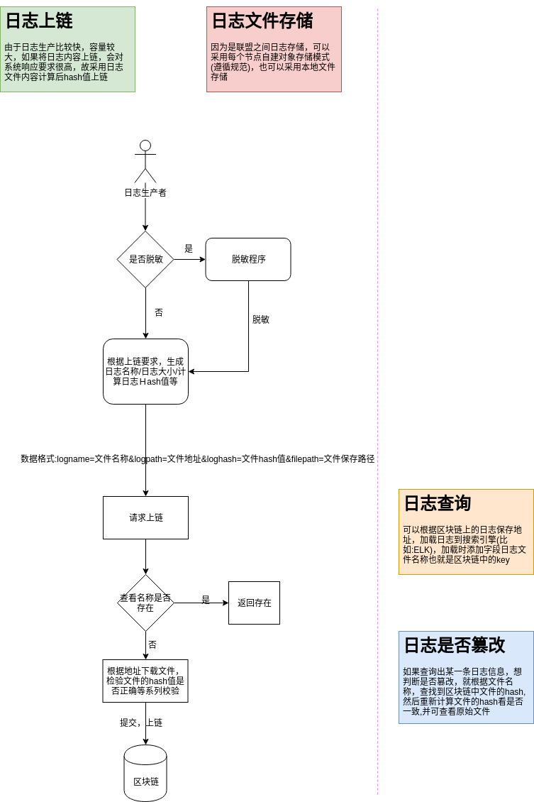

# 数据恢复与数据溯源设计

## 数据库表中数据删除的4种方案

> 以下提及表中字段`status`,0:正常 1:删除 2:清除

1. 表中增加删除标记字段(软删除)
  ```sql
   UPDATE table_name SET status=1 WHERE id=1;
  ```
  - 优点:
    1. 相比方案2，数据没真删除好恢复
    2. 相比方案3，事务更小更简单更易恢复
    3. 数据静态统计更容易(比如:按天的增，删，改)
  - 缺点:
    1. 如果删除数据多的情况下，占用物理空间较多
    2. 软删除的数据也会加载到内存，影响缓存命中和查询效率

1. 表中数据直接删除(硬删除)
  ```sql
  DALETE FROM table_name WHERE id=1;
  ```
  - 优点:
    1. 相比其他方案，节约空间
  - 缺点:
    1. 无法做删除数据的恢复和统计

1. 表中数据删除后存储到另外一张表结构相同的临时表中(硬删除+临时表存储)

  - 优点:
    1. 相比方案1，方案4 当前表无删除的数据，查询效率高
    2. 相比方案2，数据可恢复
  - 缺点:
    1. 如果数据表结构更改，数据不好完全恢复和无法恢复(表有约束，不能为空等)
    2. 相比方案1，数据统计更复杂

1. 软删除+标记`status=清除`标记任务+定时清除任务
  - 方案:
    1. 软删除：同**方案1**一致
    2. 清除标记任务：根据一些清除规则(如:数据时间，其他表是否引用等规则)来对数据打标记，可同时适用人工标记清除
    3. 定时清除任务：一些打清除标记的数据，定期清理(真删除，节约空间)或者定时归档
  - 优点:
    1. 相比方案1，数据量大可以节约空间和查询效率
    2. 相比方案2、方案3，在一定期限内，数据可容易恢复，并可静态统计
  - 缺点:
    1. 更久远的数据无法恢复
    2. 实现较复杂

## 实际项目中如何选择

#### 建议实际项目根据**删除数据量多少**执行以下删除步骤

  - 先在表中做软删除
  - 如果删除数据量多，可以指定清楚数据规则来打标记
  - 打上清楚标记后一定时间，可以定时删除或者归档备份

#### 实际大型项目应用
　　- postgres数据库中的删除策略和方案４类似，也是有删除程序定期或者手动出发删除过期数据(低版本数据)

## 实际项目中日志记录，操作记录，审计记录包含的数据项

  1. 日志记录:
    - 日志级别(dubug,info,warn,error等)
    - 记录时间
    - 请求ID(可根据opentracing生成)
    - 代码位置
    - 日志内容
    - 项目名称

  2. 操作记录:
    - 操作人
    - 操作时间
    - 服务端ip
    - 客户端ip
    - 操作方法(操作事件)
    - 请求内容
    - 返回内容
    - 响应状态
    - 项目名称
    - 服务端版本
  3. 审计记录(数据库为例):
    - 账号
    - 执行请求时间
    - SQL类型(DDL,DML,DCL,TCL)
    - 执行子类别(DELETE,UPDATE,GRANT等)
    - 执行语句
    - 执行参数
    - 响应
    - 执行结束时间
    - 客户端(名称或者ip)

## 日志记录，操作记录，审计记录如何存证,防止篡改并可溯源


