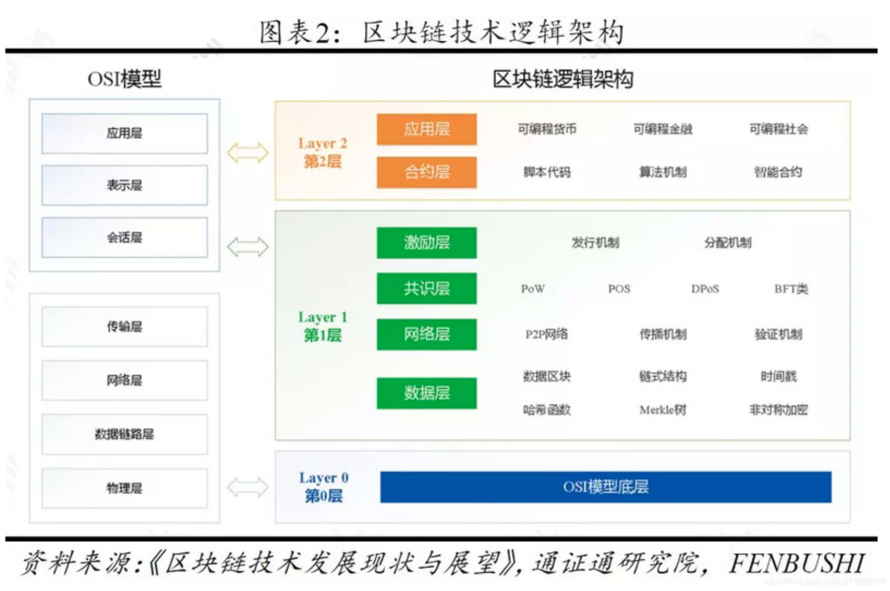

# 重要概念

## 区块链 layer0、layer1、layer2是什么 有什么作用

- Layer 0 底楼，跨链 如:Cosmos。
- Layer 1 解决信任，基础区块链网络，负责事务处理、共识和数据存储。Layer 1 的代币的存在是为了让这条底层公链能够抵抗 51% 攻击。
- Layer 2 搞定性能，提高交易速度、降低成本，依赖Layer1的安全和去中心化。对于 Layer 2 协议来说，唯一能够捕获价值的方式是存储某种外部的、有价值的状态。
- Layer 3 应用层。