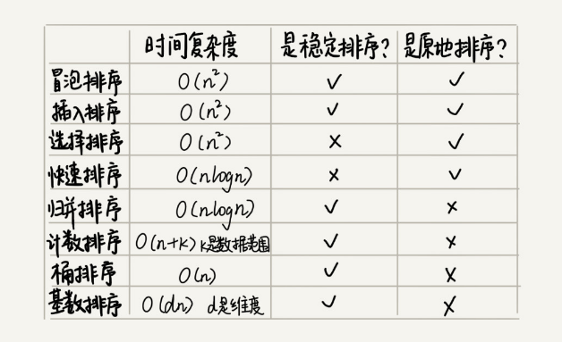

## 算法

#### 时间复杂度

- 桶排序:数据值范围较小
- 计数排序:数据值范围较小,比如500万考生成绩排序,成绩值最大600分
- 基数排序:对要排序的数据有要求,需要按照"位"来比较,而且位之间有递进关系

#### 单模式串匹配算法

1. BF(Brute Force)算法: 又称暴力匹配算法 朴素匹配算法

    - 拿模式串与主串中是所有子串匹配，看是否有能匹配的子串
    - 时间复杂度O(n*m) n、m 表示主串和模式串的长度
    - 适合数据量少情况           
      
2. RK(Rabin-Karp)算法 

    - 借助哈希算法对 BF算法进行改造
    - 对每个子串求哈希值,然后模式串的哈希值与子串的哈希值比较
    - 时间复杂度是 O(n)
      
3. BM（Boyer-Moore)算法
[理解BM算法](http://www.ruanyifeng.com/blog/2013/05/boyer-moore_string_search_algorithm.html)
    - 根据坏字符规则和好后缀规则进行匹配,遇到模式串中不能匹配的时候,将模式串多滑动几位
    - 匹配的效率却很高
      
4. KMP算法
[理解KMP算法](http://www.ruanyifeng.com/blog/2013/05/Knuth–Morris–Pratt_algorithm.html)
    - 借鉴 BM 算法的思想,利用好前缀规则
    - 时间复杂度是 O(n+m)
    - 构建一个next数组,构建方法就是**前缀与后缀交集的最大长度**
    - 遇到不匹配的字符,不需要从头开始匹配,移动到不同位置开始匹配,移动的位数=已匹配的长度-对应的部分匹配值

#### 多模式串匹配算法

1. Trie树 也叫“字典树" "前缀树"
    
    - Trie树不如红黑树和散列表适合精确匹配,它更加**适合前缀匹配**
    - 比较耗内存
    - 时间复杂度是 O(k)，k 表示要匹配的字符串的长度
    - 应用场景:字符串的字符集不能太大，前缀重合比较多
    
2. AC自动机

    - 借助KMP算法对BF算法的改进思想,对Trie树改进,增加了失败指针,类似KMP算法中的next数组,进行下次匹配的多滑动定位,不是从头开始
    - 算法实现:1.将多个模式串构建AC自动机(有分2步,1:将模式串构建Trie树 2:在Trie树上构建失败指针), 2.AC自动机中匹配主串
    
### 算法思想

#### 贪心算法

特点:
- 其他条件一样的情况下,先选贡献最大的

#### 分治算法

分治算法是一种处理问题的思想，递归是一种编程技巧

条件:
- 原问题与分解成的小问题具有相同的模式
- 原问题分解成的子问题可以独立求解，子问题之间没有相关性
- 具有分解终止条件，也就是说，当问题足够小时，可以直接求解
- 可以将子问题合并成原问题
   
  

#### 回溯算法
#### 动态规划

      
      
      
      
   
        