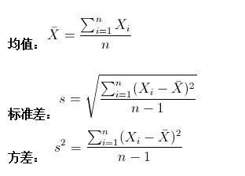

## 概念

#### 特点

- 建立在计算机和网络之上
- 数据驱动的科学
- 构建模型,对数据进行预测和分析
- 概率论 统计学 信息论 计算理论等多学科

#### 大师定义

如果一个系统能够通过执行某一个过程改进它的性能,就是学习,机器学习,其实就是统计机器学习

#### 对象

从数据出发,提取数据的特征,抽象出数据模型,发现数据中的知识,又回到对数据的分析和预测中去

#### 方法

- 监督学习
- 非监督学习
- 半监督学习
- 强化学习

##### 监督学习

- 输入空间
- 特征空间
- 输出空间

##### 三要素

方法=模型+策略+算法

1. 方法

2. 策略
输入(x),输出(y),和真实值(Y)的差距,用损失函数来度量

防止过拟合:正则化 结构风险最小化

##### 模型评估和模型选择

1. 评估
    - 训练误差
    - 测试误差:反映对未知数据的预测能力

2. 选择

- 正则化:符合奥卡姆剃刀原则
- 交叉验证:训练集 验证集 测试集

##### 基础概念

[统计学基础概念](https://www.cnblogs.com/volcao/p/9056660.html)

[解释方差和标准差](https://blog.csdn.net/yangdashi888/article/details/52397990)

[机器学习中的Bias(偏差)，Error(误差)，和Variance(方差)](https://www.zhihu.com/question/27068705)

- 偏差(bias): 度量了学习算法的期望预测与真实结果的偏离程度，即刻画了学习算法本身的拟合能力
- 中位数:排序后中间位置的数,如果是偶数个,取中间2个数的平均值
- 均值:样本集合的中间点,反映样本的有限性
- 方差(variance):用来计算每一个变量与总体均数之间的差异(衡量一组数据离散程度的度量)
- 标准差(均方差):方差算术平方根
- 均方误差（mean-square error, MSE）是反映估计量与被估计量之间差异程度的一种度量  **均方误差由点估计的方差与偏差的平方两部分组成**
- 估计量(estimator):用来估计总体未知参数用的统计量
- 协方差: 协方差用于反映两个维度之间的数据偏离期望值的相关性，若同时偏离，即为正相关，数据上现象为：(某维度偏离点-均值)*(另一维度-均值)>0，同时也能反映偏离强度，若协方差结果越大，则说明同时偏离程度大，相关性越强。
- 协方差矩阵: 协方差多了就是协方差矩阵
- 噪声: 则表达了在当前任务上任何学习算法所能达到的期望泛化误差的下界，即刻画了学习问题本身的难度

##### 总结

- low bias ->过拟合
- low variance ->欠拟合

#### 分类和回归

[分类和回归的区别](https://www.zhihu.com/question/21329754)

分类模型和回归模型本质一样,分类模型可将回归模型的输出离散化,回归模型可将分类模型的输出连续化

#### 正则化(Regularization)

**[线性回归——lasso回归和岭回归](https://www.cnblogs.com/wuliytTaotao/p/10837533.html)**

两种回归均是在标准线性回归的基础上加上正则项来减小模型的方差

[正则化](https://zhuanlan.zhihu.com/p/25707761)

- L1正则化(ℓ1-norm):又称L1范数,模型:Lasso回归

    权值向量w中各个元素的绝对值之和

- L2正则化(ℓ2-norm):又称L2范数,模型:Ridge回归（岭回归）

    指权值向量w中各个元素的平方和然后再求平方根
    
##### 相同

都可以用来解决标准线性回归的过拟合问题

##### 不同

- lasso 可以用来做 feature selection，而 ridge 不行。或者说，lasso 更容易使得权重变为 0，而 ridge 更容易使得权重接近 0
- 从贝叶斯角度看，lasso（L1 正则）等价于参数 w 的先验概率分布满足拉普拉斯分布，而 ridge（L2 正则）等价于参数 w 的先验概率分布满足高斯分

