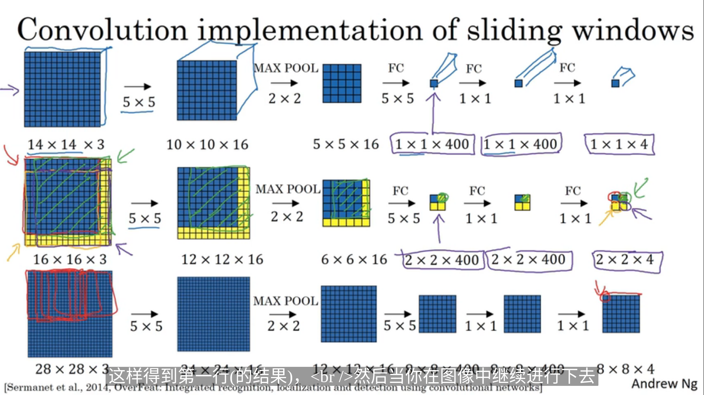

## 目标检测

[awesome-object-detection](https://github.com/amusi/awesome-object-detection)
[darknet](https://github.com/pjreddie/darknet) c实现的卷积神经网络
[labelImg](https://github.com/tzutalin/labelImg) 图像标记

#### 定义
目标检测（Object Detection）:任务是找出图像中所有感兴趣的目标（物体），确定它们的位置和大小

#### 衡量指标
- 精度(mAP)
- 速度(FPS)

#### 任务
- 分类-Classification：解决“是什么？”的问题，即给定一张图片或一段视频判断里面包含什么类别的目标。
- 定位-Location：解决“在哪里？”的问题，即定位出这个目标的的位置。
- 检测-Detection：解决“是什么？在哪里？”的问题，即定位出这个目标的的位置并且知道目标物是什么。
- 分割-Segmentation：分为实例的分割（Instance-level）和场景分割（Scene-level），解决“每一个像素属于哪个目标物或场景”的问题。

#### 算法
[基于深度学习的目标检测算法综述](https://zhuanlan.zhihu.com/p/36088972)

- two-stage:1.区域推荐 2.目标分类
    - R-CNN
    - Fast R-CNN:通过添加ROI Pooling层来减少冗余计算
    - Faster R-CNN:通过RPN网络进行区域推荐 
- one-stage:一个网络一步到位
    - YOLO:
    - SSD:综合高低层进行检测,兼顾速度和精度
    
#### 方法
- 滑动窗口:先训练一个卷积网络识别目标,然后定义窗口大小,一遍一遍的到卷积网络查看目标是否存在,缺点,计算量大
- 卷积的滑动窗口: 

#### IoU 交并比

#### 非极大值抑制

#### 置信度(confidence scores)
边界框 * IoU 来确定预测位置的精度

#### 胶囊网络(capsnet)

#### YOLO

