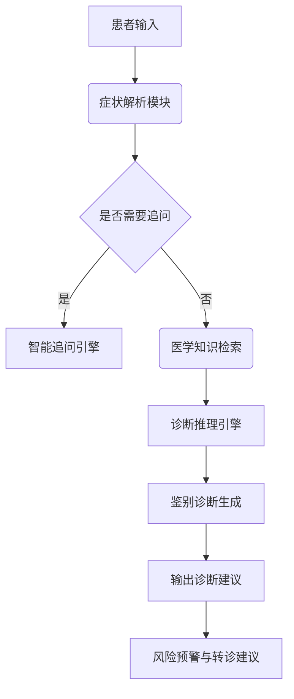

# 医疗AI

## 如何基于大模型构建一个医疗AI
- 医学知识库构建
- 大模型训练与微调
    - ​基座模型选择：
        - ​中文场景：DeepSeek-67B（医疗语料增强版）
        - ​英文场景：PubMedGPT 或 BioMedLM
    - 训练策略：
        - DAPT：领域自适应预训练
        - SFT：监督微调
- 诊断推理引擎
    - ​多阶段推理：
        - ​症状编码：将患者主诉映射到SNOMED CT标准术语
        - ​贝叶斯网络：计算疾病先验概率（基于流行病学数据）
        - ​大模型推理：生成鉴别诊断列表
        - ​决策验证：对比UpToDate最新指南
    - ​置信度控制：
        - <0.8:建议做什么检查。

## 问诊系统步骤
1. 症状解析
2. 动态追问
3. 检索增强
4. 生成诊断
5. 输出格式化
    - 安全护栏

## 本地知识库

- [ragflow](https://github.com/infiniflow/ragflow)

RAG（检索增强生成）引擎。它的作用是可以让用户创建自有知识库，根据设定的参数对知识库中的文件进行切块处理，用户向大模型提问时，RAGFlow先查找自有知识库中的切块内容，接着把查找到的知识库数据输入到对话大模型中再生成答案输出。

## Agent
传统大模型像“百科全书式学者”，只能根据输入生成文本；而 Agent 更像“具备执行能力的助手”，能拆解任务、调用工具（如搜索、计算、写代码）并迭代优化结果。
- ​关键能力：
    - ​任务分解：将复杂问题拆解为可执行的子任务（如“订机票→查天气→推荐行李”）。
    - ​工具调用：使用外部 API、数据库、代码解释器等扩展能力边界。
    - ​记忆与反思：保留历史交互记录，通过自我纠错提升表现。
- 代表框架与工具：
    - ​AutoGPT：开源自主 Agent，可联网搜索、读写文件、持续迭代任务。
    - ​LangChain Agent：支持自定义工具链（如 Wikipedia + Python REPL）。
    - ​MetaGPT：多角色协作 Agent，模拟软件公司工作流程（产品经理→工程师→测试员）。
    - ​OpenAI API Function Calling：通过函数描述让模型自主选择调用工具。

## ui
-[open-webui](https://github.com/open-webui/open-webui/pkgs/container/open-webui)