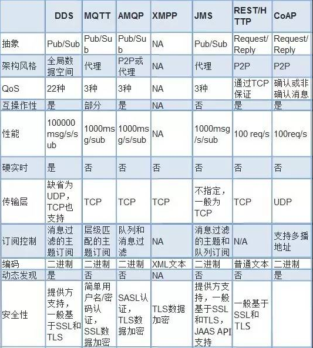

## 协议

1. REST/HTTP(松耦合服务调用)

1. CoAP(Constrained Application Protocol)，受限应用协议，应用于无线传感网中协议

    - 在资源受限的通信的IP网络

1. MQTT (Message Queuing Telemetry Transport )，消息队列遥测传输
    - [EMQX](https://github.com/emqx/emqx)
    - MQTT协议采用发布/订阅模式，所有的物联网终端都通过TCP连接到云端，云端通过主题的方式管理各个设备关注的通讯内容，负责将设备与设备之间消息的转发。
    - 适用范围：在低带宽、不可靠的网络
1. DDS(Data Distribution Service for Real-Time Systems)，面向实时系统的数据分布服务

    - 适用范围：分布式高可靠性、实时传输设备数据通信
    - 目前DDS已经广泛应用于国防、民航、工业控制等领域
    
1. AMQP(Advanced Message Queuing Protocol)，先进消息队列协议

    - 适用范围：最早应用于金融系统之间的交易消息传递(RabbitMQ)
    - 主要适用于移动手持设备与后台数据中心的通信和分析
    
1. XMPP(Extensible Messaging and Presence Protocol)可扩展通讯和表示协议

    - 即时通信的应用程序，还能用在网络管理、游戏、远端系统监控等
    
1. JMS (Java Message Service)，即消息服务

    - 是一个Java平台中关于面向消息中间件(MOM)的API